# End-to-End (E2E) Testing Blueprint - Telegram Casso

**Project**: Multi-Session Telegram Bot + UserBot System  
**Architecture**: Node.js + DDD + TypeORM + GramJS/Telegraf  
**Last Updated**: November 13, 2025

---

## 📋 Table of Contents

1. [Executive Summary](#executive-summary)
2. [Testing Strategy](#testing-strategy)
3. [E2E Test Architecture](#e2e-test-architecture)
4. [Test Environment Setup](#test-environment-setup)
5. [Test Frameworks & Tools](#test-frameworks--tools)
6. [Test Data Preparation](#test-data-preparation)
7. [Workflow Scenarios](#workflow-scenarios)
8. [Test Implementation](#test-implementation)
9. [Logging & Reporting](#logging--reporting)
10. [Execution Guide](#execution-guide)

---

## Executive Summary

This E2E testing blueprint covers complete workflows in the Telegram Casso system:

- **Admin Bot** → Command handling, channel management, session control
- **User Bot** → Message monitoring, forwarding, event handling
- **Domain Layer** → Entity validation, aggregate behavior, business logic
- **TypeORM** → CRUD operations, relationships, transactions
- **Database** → Persistence, constraints, data integrity

**Key Testing Goals**:
- ✅ Verify end-to-end bot command → domain → database → response cycle
- ✅ Validate multi-session message forwarding workflow
- ✅ Test error recovery and throttling mechanisms
- ✅ Ensure database consistency and constraints
- ✅ Validate domain entity behavior and validation
- ✅ Test inter-bot communication and state management

---

## Testing Strategy

### Scope

| Layer | Coverage | Status |
|-------|----------|--------|
| **Presentation** | AdminBot commands, UserBot event handlers | ✅ |
| **Domain** | Use cases, services, entities, aggregates | ✅ |
| **Data** | Repositories, TypeORM entities, queries | ✅ |
| **Infrastructure** | Database setup, connections, transactions | ✅ |
| **Integration** | Bot ↔ Domain ↔ Database workflows | ✅ |
| **E2E** | Full user workflows across all layers | ✅ |

### Test Categories

```
E2E Tests
├── Domain Layer Tests (30%)
│   ├── Entity validation
│   ├── Aggregate root behavior
│   ├── Value object testing
│   └── Event/command handling
├── Repository & Database Tests (25%)
│   ├── CRUD operations
│   ├── Relationships and constraints
│   ├── Transactions
│   └── Query correctness
├── Service Layer Tests (20%)
│   ├── Business logic orchestration
│   ├── Error handling
│   ├── State management
│   └── Throttling/rate limiting
├── Bot Integration Tests (15%)
│   ├── AdminBot command workflows
│   ├── UserBot event handling
│   └── Inter-bot communication
└── Full E2E Workflow Tests (10%)
    ├── Complete admin setup flow
    ├── Message forwarding workflow
    └── Multi-session orchestration
```

---

## E2E Test Architecture

### System Architecture Diagram


### Test Flow Diagram

```mermaid
graph TD
    A["📊 Test Suite Start"] --> B["Setup Test Environment"]
    B --> C["Initialize Test Database"]
    C --> D["Seed Test Data"]
    D --> E["Create Mock Bots"]
    E --> F["Inject Dependencies"]
    
    F --> G{"Test Category"}
    
    G -->|Domain| H["Domain Entity Tests"]
    G -->|Repository| I["Repository Tests"]
    G -->|Service| J["Service Tests"]
    G -->|Bot| K["Bot Command Tests"]
    G -->|Workflow| L["E2E Workflow Tests"]
    
    H --> M["Validate Entity"]
    I --> N["CRUD Operations"]
    J --> O["Business Logic"]
    K --> P["Parse & Execute"]
    L --> Q["Full Workflow"]
    
    M --> R["Verify Results"]
    N --> R
    O --> R
    P --> R
    Q --> R
    
    R --> S{"Tests Pass?"}
    S -->|✅ Yes| T["Cleanup"]
    S -->|❌ No| U["Log Failure"]
    U --> T
    T --> V["Generate Report"]
    V --> W["📈 Test Complete"]
```



### Complete Workflow Sequence


---

## Test Environment Setup

### Prerequisites

```
Node.js:    >= 18.0.0
npm:        >= 9.0.0
Docker:     (optional, for isolated testing)
Git:        For version control
```

### 1. Install Test Dependencies

```bash
npm install --save-dev \
  jest@latest \
  @jest/globals@latest \
  jest-mock-extended@latest \
  jest-setup-extend@latest \
  typescript-eslint/latest \
  better-sqlite3-helper@latest
```

### 2. Test Database Setup (SQLite In-Memory)

Create `test/setup/testDatabaseSetup.js`:

```javascript
// Test database configuration for isolated E2E testing
import { DataSource } from 'typeorm';
import { entities } from '../../src/core/entities/orm/index.js';

export async function setupTestDatabase() {
  const dataSource = new DataSource({
    type: 'sqlite',
    database: ':memory:', // In-memory for fast tests
    entities: Object.values(entities),
    synchronize: true,
    logging: false
  });

  await dataSource.initialize();
  return dataSource;
}

export async function cleanupTestDatabase(dataSource) {
  if (dataSource?.isInitialized) {
    await dataSource.destroy();
  }
}
```

### 3. Dependency Injection for Tests

Create `test/setup/testContainer.js`:

```javascript
// Test DI container with mocked services
import Container from '../../src/shared/container/Container.js';
import * as repositories from '../../src/data/repositories/index.js';

export function setupTestContainer(dataSource) {
  const container = Container.getInstance();
  
  // Register repositories with test database
  container.registerSingleton('channelRepository', 
    new repositories.ChannelRepository(dataSource));
  container.registerSingleton('sessionRepository',
    new repositories.SessionRepository(dataSource));
  container.registerSingleton('messageRepository',
    new repositories.MessageRepository(dataSource));
  container.registerSingleton('userRepository',
    new repositories.UserRepository(dataSource));
  container.registerSingleton('adminRepository',
    new repositories.AdminRepository(dataSource));
    
  // Register mocked services
  container.registerSingleton('throttleService', createMockThrottleService());
  container.registerSingleton('stateManager', createMockStateManager());
  
  return container;
}

function createMockThrottleService() {
  return {
    checkLimit: jest.fn().mockResolvedValue(true),
    recordEvent: jest.fn().mockResolvedValue(true),
    reset: jest.fn().mockResolvedValue(true)
  };
}

function createMockStateManager() {
  return {
    setState: jest.fn(),
    getState: jest.fn(),
    registerBot: jest.fn(),
    getBot: jest.fn()
  };
}
```

### 4. Mock Telegram Setup

Create `test/setup/mockTelegram.js`:

```javascript
// Mock Telegram clients for isolated testing
export function createMockTelegramClient() {
  return {
    connect: jest.fn().mockResolvedValue(true),
    disconnect: jest.fn().mockResolvedValue(true),
    isUserAuthorized: jest.fn().mockResolvedValue(true),
    getMe: jest.fn().mockResolvedValue({
      id: '123456789',
      firstName: 'TestBot',
      isBot: false
    }),
    getEntity: jest.fn().mockResolvedValue({
      id: '-1001234567890',
      title: 'Test Channel',
      username: 'testchannel'
    }),
    addEventHandler: jest.fn(),
    removeEventHandler: jest.fn()
  };
}

export function createMockTelegrafBot() {
  return {
    start: jest.fn().mockResolvedValue(true),
    stop: jest.fn().mockResolvedValue(true),
    launch: jest.fn().mockResolvedValue(true),
    telegram: {
      sendMessage: jest.fn().mockResolvedValue({ message_id: 1 }),
      editMessageText: jest.fn().mockResolvedValue(true),
      deleteMessage: jest.fn().mockResolvedValue(true)
    },
    command: jest.fn(),
    on: jest.fn(),
    action: jest.fn(),
    middleware: jest.fn().mockReturnValue(jest.fn())
  };
}
```

### 5. Test Data Fixtures

Create `test/fixtures/seedTestData.js`:

```javascript
// Seed test database with realistic data
export async function seedTestData(dataSource) {
  const adminRepo = dataSource.getRepository('Admin');
  const sessionRepo = dataSource.getRepository('Session');
  const channelRepo = dataSource.getRepository('Channel');
  const userRepo = dataSource.getRepository('User');

  // Create test admin
  const admin = await adminRepo.save({
    userId: '123456789',
    firstName: 'Test',
    lastName: 'Admin',
    phone: '+1234567890',
    role: 'ADMIN',
    isActive: true
  });

  // Create test session
  const session = await sessionRepo.save({
    adminId: admin.id,
    sessionString: 'test_session_string_encrypted',
    status: 'active',
    autoPaused: false
  });

  // Create test channels
  const channel1 = await channelRepo.save({
    channelId: '-1001234567890',
    accessHash: 'test_hash_1',
    title: 'Test Channel 1',
    username: 'testchannel1',
    memberCount: 100,
    forwardEnabled: true,
    adminId: admin.id
  });

  const channel2 = await channelRepo.save({
    channelId: '-1001234567891',
    accessHash: 'test_hash_2',
    title: 'Test Channel 2',
    username: 'testchannel2',
    memberCount: 50,
    forwardEnabled: true,
    adminId: admin.id
  });

  // Create test users
  const users = [];
  for (let i = 1; i <= 10; i++) {
    const user = await userRepo.save({
      userId: `999999${String(i).padStart(3, '0')}`,
      firstName: `User${i}`,
      lastName: 'Test',
      username: `testuser${i}`,
      isBot: false
    });
    users.push(user);
  }

  return {
    admin,
    session,
    channels: [channel1, channel2],
    users
  };
}
```

---

## Test Frameworks & Tools

### Core Testing Stack

```json
{
  "testRunner": "Jest 29+",
  "assertions": "Jest Built-in + Custom Matchers",
  "mocking": "jest-mock-extended",
  "database": "SQLite (in-memory) + TypeORM",
  "coverage": "Jest Coverage",
  "reporting": "Jest + Custom HTML Reporter",
  "asyncTesting": "jest.runAllTimers() + async/await",
  "containerTesting": "Docker (optional for isolated DB)"
}
```

### Recommended Setup

```bash
# Install all test dependencies
npm install --save-dev \
  jest \
  @jest/globals \
  jest-mock-extended \
  jest-setup-extend \
  supertest \
  @types/jest \
  jest-environment-jsdom

# Optional: For HTML reporting
npm install --save-dev jest-html-reporters allure-commandline
```

### Jest Configuration Enhancement

Update `jest.config.js`:

```javascript
module.exports = {
  testEnvironment: 'node',
  testMatch: ['**/__tests__/**/*.spec.js', '**/?(*.)+(spec|test).js'],
  collectCoverageFrom: [
    'src/**/*.js',
    '!src/**/*.spec.js',
    '!src/index.js'
  ],
  coveragePathIgnorePatterns: [
    '/node_modules/',
    '/dist/',
    '/test/'
  ],
  setupFilesAfterEnv: ['<rootDir>/jest.setup.js', '<rootDir>/test/setup/e2e-setup.js'],
  testTimeout: 30000, // 30 seconds for E2E tests
  maxWorkers: 1, // Sequential for database consistency
  detectOpenHandles: true,
  forceExit: true,
  globals: {
    'ts-jest': {
      isolatedModules: true
    }
  }
};
```

---

## Test Data Preparation

### Test Data Factories

Create `test/factories/EntityFactory.js`:

```javascript
export class EntityFactory {
  static createAdmin(overrides = {}) {
    return {
      id: Math.floor(Math.random() * 10000),
      userId: '123456789',
      firstName: 'Test',
      lastName: 'Admin',
      phone: '+1234567890',
      role: 'ADMIN',
      isActive: true,
      createdAt: new Date(),
      updatedAt: new Date(),
      ...overrides
    };
  }

  static createSession(overrides = {}) {
    return {
      id: Math.floor(Math.random() * 10000),
      adminId: 1,
      sessionString: `session_${Date.now()}`,
      status: 'active',
      autoPaused: false,
      floodWaitUntil: null,
      lastError: null,
      lastActive: new Date(),
      ...overrides
    };
  }

  static createChannel(overrides = {}) {
    return {
      id: Math.floor(Math.random() * 10000),
      channelId: `-100123456${Math.floor(Math.random() * 10000)}`,
      accessHash: `hash_${Date.now()}`,
      title: `Test Channel ${Date.now()}`,
      username: `testchannel${Math.floor(Math.random() * 10000)}`,
      memberCount: Math.floor(Math.random() * 1000),
      forwardEnabled: true,
      throttleDelayMs: 1000,
      throttlePerMemberMs: 500,
      minDelayMs: 2000,
      maxDelayMs: 5000,
      scheduleEnabled: false,
      scheduleConfig: null,
      adminId: 1,
      createdAt: new Date(),
      updatedAt: new Date(),
      ...overrides
    };
  }

  static createMessage(overrides = {}) {
    return {
      id: Math.floor(Math.random() * 10000),
      messageId: String(Math.floor(Math.random() * 100000)),
      forwardedMessageId: null,
      channelId: '-1001234567890',
      userId: '999999999',
      status: 'PENDING',
      errorMessage: null,
      retryCount: 0,
      groupedId: null,
      isGrouped: false,
      createdAt: new Date(),
      updatedAt: new Date(),
      ...overrides
    };
  }

  static createUser(overrides = {}) {
    return {
      id: Math.floor(Math.random() * 10000),
      userId: `999999${Math.floor(Math.random() * 10000)}`,
      firstName: 'Test',
      lastName: 'User',
      username: `testuser${Math.floor(Math.random() * 10000)}`,
      isBot: false,
      createdAt: new Date(),
      ...overrides
    };
  }
}
```

### Seeding Strategies

```javascript
export async function seedMinimalData(dataSource) {
  // Minimal: Only required for basic tests
  return {
    admin: await createAdmin(dataSource),
    session: await createSession(dataSource)
  };
}

export async function seedCompleteData(dataSource) {
  // Complete: Full workflow testing
  const admin = await createAdmin(dataSource);
  const session = await createSession(dataSource, admin);
  const channels = await createChannels(dataSource, admin, 5);
  const users = await createUsers(dataSource, 50);
  const messages = await createMessages(dataSource, channels, users, 100);
  
  return { admin, session, channels, users, messages };
}

export async function seedForwardingScenario(dataSource) {
  // Forwarding test: Message forwarding workflow
  const admin = await createAdmin(dataSource);
  const session = await createSession(dataSource, admin);
  const channel = await createChannel(dataSource, admin);
  const users = await createUsers(dataSource, 20);
  
  return { admin, session, channel, users };
}
```

---

## Workflow Scenarios

### Scenario 1: Admin Registration & Session Setup (Domain + DB)

**Workflow**:
```
Admin /start
  ↓ [Parse Command]
AdminBot → RegisterAdminUseCase
  ↓ [Create Entity]
Domain → Admin Entity validated
  ↓ [Persist]
Repo → TypeORM → Database (INSERT)
  ↓ [Return]
Bot → Response Message
  ↓ [Assertion]
✅ Admin in DB with status=ACTIVE
```

**Test Steps**:
1. Create mock AdminBot
2. Simulate `/start` command
3. Verify RegisterAdminUseCase called
4. Assert Admin entity created correctly
5. Verify persisted in database
6. Check response sent to user
7. Query database to confirm

**Assertions**:
- Admin record exists in database
- Admin.isActive = true
- Admin.userId matches request
- Admin.createdAt is recent
- Response message sent successfully

### Scenario 2: Channel Addition & Configuration (Domain + Service + DB)

**Workflow**:
```
Admin /add_channel #channel_id
  ↓ [Extract Channel ID]
AdminBot → AddChannelUseCase
  ↓ [Validate]
Domain → Channel Entity validation
  ↓ [Check Session]
Service → Verify admin has active session
  ↓ [Get Channel Info]
Service → Fetch from Telegram API (mocked)
  ↓ [Create]
Domain → Channel aggregate root
  ↓ [Persist]
Repo → TypeORM → Database (INSERT)
  ↓ [Update State]
State → Channel added to state manager
  ↓ [Response]
Bot → Channel added successfully
  ↓ [Assertion]
✅ Channel in DB, forwarding enabled
```

**Test Steps**:
1. Setup admin + session
2. Call AddChannelUseCase
3. Verify Channel entity created
4. Check validation logic
5. Verify persistence layer called
6. Assert database record
7. Verify state updated

**Assertions**:
- Channel record in database
- Channel.forwardEnabled = true
- Channel.throttleDelayMs set correctly
- Channel.adminId = registered admin
- No errors in use case execution

### Scenario 3: Message Forwarding Workflow (Full Stack)

**Workflow**:
```
Telegram → Message received in monitored channel
  ↓ [Event Handler]
UserBot → ChannelEventHandler.onNewMessage()
  ↓ [Extract Message]
Domain → Message Entity created
  ↓ [Validation]
Service → Validate channel enabled for forwarding
  ↓ [Get Recipients]
Repo → Query users for channel (DB Query)
  ↓ [Throttle Check]
Service → ThrottleService checks rate limits
  ↓ [Forward]
UserBot → Send to each user (rate limited)
  ↓ [Log]
Repo → LogMessageUseCase records each forward
  ↓ [Database]
ORM → INSERT message logs (batch)
  ↓ [Update State]
State → Update forwarding metrics
  ↓ [Assertion]
✅ All messages logged, throttling applied
```

**Test Steps**:
1. Setup: admin, session, channel, users
2. Simulate message event
3. Call LogMessageUseCase
4. Verify ForwardingService.forwardToUsers()
5. Check throttle service called for each user
6. Verify messages logged
7. Assert database records created
8. Check state updated

**Assertions**:
- Message log created for each user
- Message.status = SUCCESS or PENDING
- Throttle service called with correct params
- Database has all message records
- State metrics updated

### Scenario 4: Error Recovery & Retry Logic (Service + Domain)

**Workflow**:
```
Forward attempt → Telegram API error (FloodWait)
  ↓ [Error Handler]
Service → handleTelegramError()
  ↓ [Classify Error]
Service → Identify FloodWait/AuthError
  ↓ [Retry Logic]
Domain → Increment retryCount
  ↓ [Schedule Retry]
Service → Queue retry with delay
  ↓ [Throttle Adjustment]
Service → Increase throttle on failure
  ↓ [State Update]
State → Mark session paused if critical
  ↓ [Logging]
Logger → Log error with context
  ↓ [Database]
Repo → Update message.status = FAILED
  ↓ [Assertion]
✅ Error handled, retry scheduled
```

**Test Steps**:
1. Setup forwarding scenario
2. Mock Telegram API to return FloodWait error
3. Simulate message forward
4. Verify error handling triggered
5. Assert retry scheduled
6. Check message status updated
7. Verify throttle increased
8. Check state updated

**Assertions**:
- Message.retryCount incremented
- Message.status = FAILED initially
- Retry scheduled with correct delay
- ThrottleService adjusted
- Error logged with context
- Session paused if critical

### Scenario 5: Multi-Session Load Balancing (Orchestration)

**Workflow**:
```
3 Sessions configured:
  Session A (active)
  Session B (active)
  Session C (paused)
  
100 messages in queue
  ↓ [Load Balancer]
Service → ForwardingService checks session status
  ↓ [Distribute]
Service → Assign to Session A (30 msgs)
Service → Assign to Session B (30 msgs)
Service → Skip Session C (paused)
  ↓ [Queue]
Queue → Persist assignments to database
  ↓ [Process]
Session A → Forward 30 messages
Session B → Forward 30 messages
  ↓ [Throttle]
Both respect per-session throttling
  ↓ [Metrics]
Repo → Update session metrics
  ↓ [Assertion]
✅ Load balanced, throttled, logged
```

**Test Steps**:
1. Create 3 sessions (2 active, 1 paused)
2. Create 100 messages
3. Call ForwardingService with multi-session
4. Verify load balancing logic
5. Assert messages distributed
6. Check queue updated
7. Verify metrics recorded
8. Assert throttling per session

**Assertions**:
- Messages distributed across active sessions
- Paused session skipped
- Each session respects its throttle
- Metrics updated for each session
- Queue records created

---

## Test Implementation

### Structure

```
test/
├── __tests__/
│   ├── domain/
│   │   ├── entities/
│   │   │   ├── Admin.entity.spec.js
│   │   │   ├── Channel.entity.spec.js
│   │   │   ├── Message.entity.spec.js
│   │   │   └── Session.entity.spec.js
│   │   ├── services/
│   │   │   ├── ForwardingService.spec.js
│   │   │   ├── ThrottleService.spec.js
│   │   │   └── MetricsService.spec.js
│   │   └── use-cases/
│   │       ├── CreateSessionUseCase.spec.js
│   │       ├── AddChannelUseCase.spec.js
│   │       └── LogMessageUseCase.spec.js
│   ├── data/
│   │   ├── repositories/
│   │   │   ├── ChannelRepository.spec.js
│   │   │   ├── SessionRepository.spec.js
│   │   │   └── MessageRepository.spec.js
│   │   └── orm/
│   │       ├── ORM-integrity.spec.js
│   │       └── ORM-relationships.spec.js
│   ├── presentation/
│   │   ├── AdminBotController.spec.js
│   │   ├── UserBotController.spec.js
│   │   └── eventHandlers.spec.js
│   └── e2e/
│       ├── admin-registration.e2e.spec.js
│       ├── channel-management.e2e.spec.js
│       ├── message-forwarding.e2e.spec.js
│       ├── error-recovery.e2e.spec.js
│       └── multi-session-workflow.e2e.spec.js
├── setup/
│   ├── testDatabaseSetup.js
│   ├── testContainer.js
│   ├── mockTelegram.js
│   └── e2e-setup.js
├── fixtures/
│   ├── seedTestData.js
│   ├── EntityFactory.js
│   └── testScenarios.js
└── helpers/
    ├── assertions.js
    ├── database-helpers.js
    └── cleanup.js
```

---

## Logging & Reporting

### Test Failure Capture

Create `test/helpers/failureCapture.js`:

```javascript
export class FailureCapture {
  static async captureOnFailure(testName, dataSource) {
    const timestamp = new Date().toISOString().replace(/:/g, '-');
    const failureDir = `./test-failures/${testName}-${timestamp}`;
    
    try {
      // Capture database snapshot
      await this.captureDatabaseSnapshot(dataSource, failureDir);
      
      // Capture logs
      await this.captureLogs(failureDir);
      
      // Capture memory state
      this.captureMemoryState(failureDir);
      
      console.log(`❌ Failure captured at: ${failureDir}`);
    } catch (error) {
      console.error('Failed to capture failure:', error);
    }
  }

  static async captureDatabaseSnapshot(dataSource, failureDir) {
    const managers = {
      admins: dataSource.getRepository('Admin'),
      sessions: dataSource.getRepository('Session'),
      channels: dataSource.getRepository('Channel'),
      messages: dataSource.getRepository('Message'),
      users: dataSource.getRepository('User')
    };

    for (const [entity, repo] of Object.entries(managers)) {
      const data = await repo.find();
      fs.writeFileSync(
        `${failureDir}/${entity}.json`,
        JSON.stringify(data, null, 2)
      );
    }
  }

  static async captureLogs(failureDir) {
    const logsPath = './logs';
    if (fs.existsSync(logsPath)) {
      fs.cpSync(logsPath, `${failureDir}/logs`, { recursive: true });
    }
  }

  static captureMemoryState(failureDir) {
    const memUsage = process.memoryUsage();
    fs.writeFileSync(
      `${failureDir}/memory.json`,
      JSON.stringify(memUsage, null, 2)
    );
  }
}
```

### Jest Reporter Configuration

```javascript
// jest.config.js
module.exports = {
  reporters: [
    'default',
    [
      'jest-junit',
      {
        outputDirectory: './test-results',
        outputName: 'junit.xml',
        classNameTemplate: '{classname}',
        titleTemplate: '{title}',
        ancestorSeparator: ' › ',
        usePathAsClassName: 'true'
      }
    ],
    [
      'jest-html-reporters',
      {
        publicPath: './test-results/html',
        filename: 'report.html',
        expand: true,
        pageTitle: 'E2E Test Report',
        openReport: false
      }
    ]
  ]
};
```

### Coverage Reports

```bash
# Generate coverage report
npm test -- --coverage

# Generate HTML coverage report
npm test -- --coverage --coverageReporters=html

# View HTML report
open coverage/index.html
```

### Logging Strategy

```javascript
// test/helpers/testLogger.js
export class TestLogger {
  constructor(testName) {
    this.testName = testName;
    this.logs = [];
  }

  info(message, data) {
    const entry = { timestamp: new Date(), level: 'INFO', message, data };
    this.logs.push(entry);
    console.log(`[${this.testName}] INFO: ${message}`, data || '');
  }

  error(message, error) {
    const entry = { timestamp: new Date(), level: 'ERROR', message, error };
    this.logs.push(entry);
    console.error(`[${this.testName}] ERROR: ${message}`, error || '');
  }

  writeLogs(filename) {
    fs.writeFileSync(filename, JSON.stringify(this.logs, null, 2));
  }
}
```

---

## Execution Guide

### Running E2E Tests

```bash
# Run all E2E tests
npm run test:e2e

# Run specific test file
npm run test:e2e -- admin-registration.e2e.spec.js

# Run with coverage
npm run test:e2e -- --coverage

# Run in watch mode (development)
npm run test:e2e -- --watch

# Run with verbose output
npm run test:e2e -- --verbose

# Run with specific test pattern
npm run test:e2e -- --testNamePattern="Admin Registration"
```

### Package.json Scripts

```json
{
  "scripts": {
    "test:e2e": "jest test/__tests__/e2e --runInBand --detectOpenHandles",
    "test:domain": "jest test/__tests__/domain",
    "test:data": "jest test/__tests__/data",
    "test:presentation": "jest test/__tests__/presentation",
    "test:all": "jest --coverage",
    "test:watch": "jest --watch",
    "test:debug": "node --inspect-brk node_modules/.bin/jest --runInBand"
  }
}
```

### CI/CD Integration

```yaml
# .github/workflows/e2e-tests.yml (Example for GitHub Actions)
name: E2E Tests

on: [push, pull_request]

jobs:
  test:
    runs-on: ubuntu-latest
    
    services:
      sqlite:
        image: busybox
        
    steps:
      - uses: actions/checkout@v3
      - uses: actions/setup-node@v3
        with:
          node-version: '18'
          
      - name: Install dependencies
        run: npm ci
        
      - name: Run E2E tests
        run: npm run test:e2e -- --coverage
        
      - name: Upload coverage
        uses: codecov/codecov-action@v3
```

### Performance Benchmarking

```javascript
// test/helpers/benchmark.js
export class TestBenchmark {
  static async measure(name, fn) {
    const start = performance.now();
    const result = await fn();
    const duration = performance.now() - start;
    
    console.log(`⏱️  ${name}: ${duration.toFixed(2)}ms`);
    
    return { result, duration };
  }

  static async comparePerformance(tests) {
    for (const test of tests) {
      await this.measure(test.name, test.fn);
    }
  }
}
```

---

## Next Steps

1. **Copy test skeleton files** from Section "Test Implementation"
2. **Setup test environment** following "Test Environment Setup"
3. **Implement fixtures** using "Test Data Preparation"
4. **Create test cases** for each scenario
5. **Run tests locally** before committing
6. **Generate reports** and review coverage
7. **Integrate into CI/CD** pipeline

---

## Appendix: Quick Reference

### Key Test Patterns

```javascript
// Pattern 1: Repository CRUD Test
test('should create and retrieve channel', async () => {
  const channel = await channelRepo.create(testChannel);
  const retrieved = await channelRepo.findById(channel.id);
  expect(retrieved).toEqual(channel);
});

// Pattern 2: Use Case Test
test('should add channel with validation', async () => {
  const useCase = new AddChannelUseCase(channelRepo, sessionRepo);
  const result = await useCase.execute(testChannelData);
  expect(result.success).toBe(true);
  expect(result.channel.id).toBeDefined();
});

// Pattern 3: Service Test
test('should forward message with throttling', async () => {
  const service = new ForwardingService(config);
  await service.forwardToUsers(message, users);
  expect(throttleService.checkLimit).toHaveBeenCalled();
});

// Pattern 4: E2E Workflow Test
test('should complete admin registration to forwarding', async () => {
  // 1. Register admin
  await adminBot.sendMessage('/start');
  // 2. Verify in database
  const admin = await adminRepo.findByUserId(userId);
  expect(admin).toBeDefined();
  // 3. Add channel
  await adminBot.sendMessage('/add_channel');
  // 4. Verify channel
  const channel = await channelRepo.findByChannelId(channelId);
  expect(channel).toBeDefined();
});
```

### Common Assertions

```javascript
// Entity assertions
expect(admin).toBeValidAdmin();
expect(repo).toBeValidRepository();

// Database assertions
expect(await channelRepo.findAll()).toHaveLength(5);
expect(channel.forwardEnabled).toBe(true);

// State assertions
expect(stateManager.getState('channel_123')).toBeDefined();

// Service assertions
expect(throttleService.checkLimit).toHaveBeenCalledWith(userId);
```

---

**End of E2E Test Blueprint**

Generated: November 13, 2025  
For: Telegram Casso Project  
Architecture: DDD + TypeORM + Telegraf + GramJS
